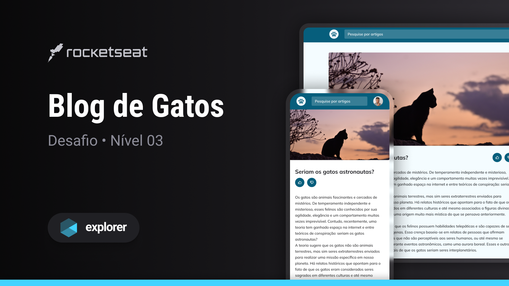

# [Cats Blog](https://matheus1714.github.io/explorer-cats-blog/) 🚀



This challenge consists of developing a responsive blog site with articles about cats. The project also features a search bar, related article recommendation and article rating.

## Design

This Front-end project was developed based on the design proposed in [Figma](<https://www.figma.com/file/fkjmSwMg04hUUBnOhGwfKh/Blog-de-Gatos-%E2%80%A2-Desafio-Explorer-(Community)?type=design&node-id=0%3A1&mode=design&t=0D2Sbb3HxbkBLcIx-1>).


## Technologies

- HTML
- CSS
- SCSS

## Run Project

Clone this repository with the command:

```shell
git clone https://github.com/Matheus1714/explorer-cats-blog.git
```

Open the `index.html` on your broser.

## Edit Project

If you want edit this project so edit using the files: `index.html` and `styles.scss`.

Compile the `scss` file to `css/styles.min.css`.

I used [Live Sass Compiler](https://marketplace.visualstudio.com/items?itemName=ritwickdey.live-sass) to develop on [VSCode](https://code.visualstudio.com/).

## Acknowledgment

Thanks to [Rocketseat](https://www.rocketseat.com.br/) for this challenge and initiatives it provides.🚀
